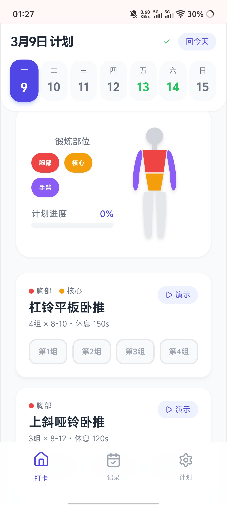
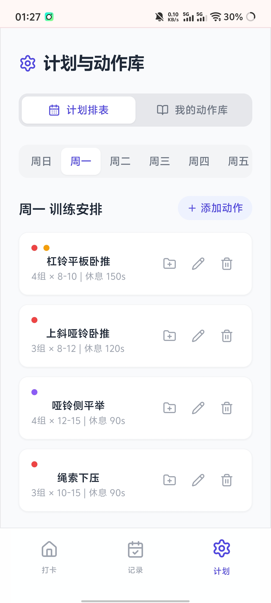
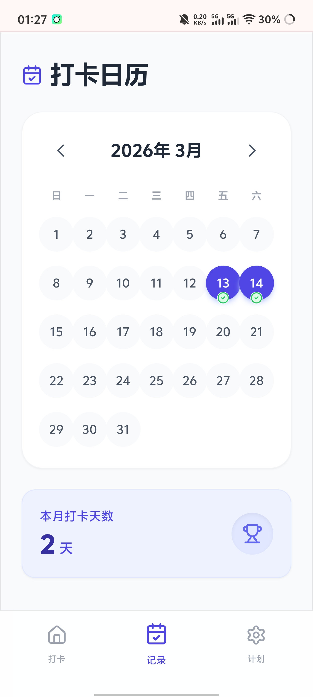

# 🏋️‍♂️ 新手健身打卡助手 (Fitness Tracker)

一款专为新手设计的**纯本地、零延迟、离线可用**的沉浸式健身打卡 PWA 应用。告别繁琐的网络同步和加载等待，让健身数据和动作演示视频安全地永久保存在你的手机里。

## ✨ 核心特性

- **🚀 零延迟与离线访问**
  - 基于现代浏览器的 `localStorage` 进行状态持久化，无需联网，打开即用，数据绝对私密。
- **🎬 突破性的本地视频存储 (IndexedDB)**
  - 支持上传最高 50MB 的自定义动作演示视频。
  - 通过 `IndexedDB` 将视频物理文件直接存入手机底层硬盘，告别 URL 失效，次日依然“秒播”。
- **💪 可视化肌肉分布图**
  - 首页动态 SVG 身体示意图，根据今日训练计划自动点亮锻炼部位（胸、背、腿、核心、手臂），直观展示训练目标。
- **📚 专属动作库体系**
  - 内置 10 个常见新手动作，并支持一键将自定义动作存入“我的动作库”。
  - 傻瓜式排表：从动作库中点选即可安排一整周的训练计划。
- **⏱️ 沉浸式倒计时体验**
  - 组间休息自动触发悬浮倒计时，支持后台运行提醒，随时把控训练节奏。
- **📅 视觉化打卡日历**
  - 月度日历视图直观展示打卡足迹，自动统计当月训练天数，带来满满成就感。

## 🛠️ 技术栈

- **前端框架**: React 18
- **样式引擎**: Tailwind CSS (通过 CDN 动态注入，极速排版)
- **图标库**: Lucide React
- **数据存储**: localStorage (轻量数据) + IndexedDB (大型多媒体数据)
- **部署方式**: Vercel (支持 PWA 添加到手机主屏幕)

## 📱 界面预览

| **首页打卡与肌肉热图**                    | **动作库与计划管理**                        | **沉浸式日历与记录**                          |
| ----------------------------------------- | :------------------------------------------ | --------------------------------------------- |
|  |  |  |

## 🚀 快速开始

如果你想在本地电脑上运行或二次开发此项目，请按照以下步骤操作：

### 1. 克隆项目

```
git clone [https://github.com/你的用户名/my-fitness-app.git](https://github.com/你的用户名/my-fitness-app.git)
cd my-fitness-app
```

### 2. 安装依赖

```
npm install
```

### 3. 本地启动

```
npm run dev
```

打开浏览器访问控制台输出的 `http://localhost:5173` 即可预览。

## 🌐 部署与使用建议

本项目极其适合部署在 **Vercel** 等免费托管平台上：

1. 将代码推送到 GitHub 后，在 Vercel 中一键 Import 即可完成部署。
2. 绑定自己的专属域名后，国内访问无障碍。
3. **强烈建议**：在手机自带浏览器 (iOS 推荐 Safari，Android 推荐 Chrome) 中打开网址，并选择**“添加到主屏幕” (Add to Home Screen)**，即可获得媲美原生 App 的无边框全屏体验。

## 📝 后续开发计划 (TODO)

- [ ] 支持打卡数据的导出与导入 (JSON 备份)
- [ ] 增加深色模式 (Dark Mode)
- [ ] 增加体重体重体脂变化折线图

## 📄 开源协议

本项目遵循 [MIT License](https://www.google.com/search?q=LICENSE) 开源协议。
